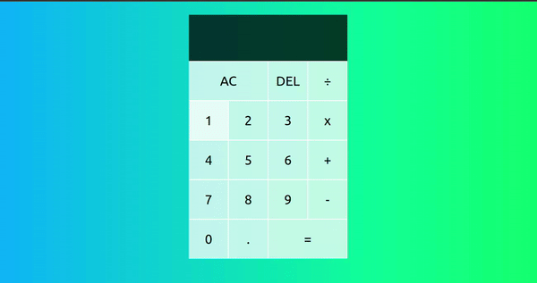

<h1 align="center">React Calculator</h1>

  

Download the .zip and unziped it or clone the project

cd ReactCalculator

npm start

I made a folder _src/calculator_ and another _public/calculator_

So, if you want, you can just use the component <Calculator /> in your own projects.

Any feedback or suggestion will be appreciated. ^^

    The Class is here:
    <a href="https://www.youtube.com/watch?v=DgRrrOt0Vr8">
        The Perfect Beginner React Project
    </a>

    

